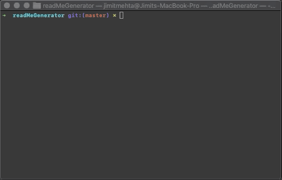

# Generate a README.md

This project generates a quick README.md file based on user prompts on the command line using node

---

## Contents

- [Motivation](#Motivation)
- [How to install](#how-to-install)
- [How to use](#how-to-use)
- [Contributors](#contributors)
- [How to test](#how-to-test)
- [Additional questions or comments](#additional-questions-or-comments)
- [Licenses](#licenses)
- [Email to contact me](#email-to-contact-me)

---

## Motivation

```
AS A developer

I WANT a README generator

SO THAT I can easily put together a good README for a new project
```

---

## How to install

Use `npm install` to install all the required dependencies



---

## How to use

You can use this project anywhere. It will generate a clean **README.md** file for any type of projects


---

## Contributors

Jim Mehta

---

## How to test

You will need `node.js` to run this project

---

## Additional questions or comments

Feel free to contact me on my email for further information about this project

---

## Licenses


---

## Email to contact me

jimit1@gmail.com
